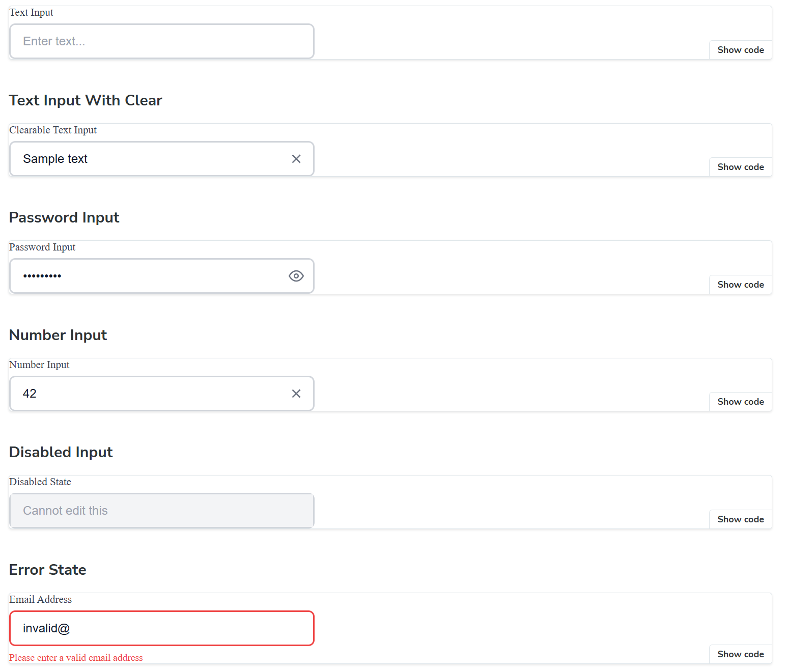
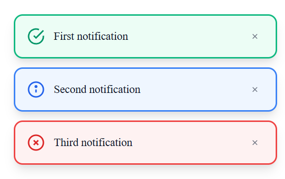
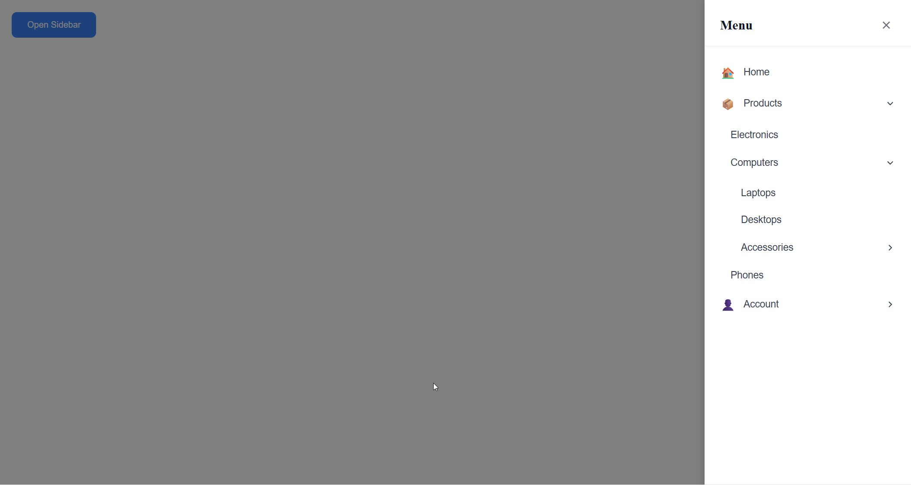

# React Component Library

A professional, reusable UI component library built with **React**, **TypeScript**, **Storybook**, and **Framer Motion**. This library features strict type safety, clean architecture, and comprehensive testing.

## ✨ Features

- 🎯 **Strict TypeScript** - Zero `any` types, full type safety
- 🎨 **Modern Design** - Beautiful UI with smooth animations via Framer Motion
- 📚 **Storybook Integration** - Interactive component documentation with live controls
- ✅ **Comprehensive Testing** - Vitest unit tests for all components
- 🏗️ **Clean Architecture** - Separation of concerns (types, hooks, styles, view)
- 🎭 **Styled Components** - Type-safe, scoped CSS-in-JS styling
- 📦 **Self-Documenting** - No comments, highly descriptive naming

## 🛠️ Tech Stack

- **React 18** - Modern React with hooks
- **TypeScript 5** - Strict type checking
- **Storybook 8** - Component development and documentation
- **Framer Motion 11** - Smooth, performant animations
- **Styled-components 6** - CSS-in-JS with theming
- **Vitest** - Fast unit testing framework
- **ESLint** - Code quality and consistency
- **Vite** - Lightning-fast build tool

## 📦 Components

### Input Component 🔤
Multi-functional input field with advanced features:
- **Type Support**: Text, password, number
- **Password Toggle**: Eye icon to show/hide password
- **Clearable**: Optional X button to clear input
- **Error States**: Visual feedback with error messages
- **Disabled State**: Proper styling and behavior

### Toast Component 🔔
Notification system with auto-dismiss and animations:
- **Variants**: Success, error, info with distinct colors and icons
- **Auto-dismiss**: Configurable duration
- **Manual Close**: Close button for user control
- **Positioning**: Fixed bottom-right corner
- **Animations**: Smooth slide and fade with Framer Motion
- **Stacking**: Multiple toasts stack gracefully

### Sidebar Menu Component 📚
Responsive navigation panel with nested menu support:
- **Slide Animation**: Smooth slide-in from right
- **Nested Menus**: Recursive submenu support (unlimited depth)
- **Expandable Items**: Click to expand/collapse submenus
- **Click-outside**: Auto-close when clicking outside
- **Keyboard Support**: ESC key to close
- **Icons**: Optional icon support for menu items

## 🚀 Getting Started

### Prerequisites

- Node.js 18+ (recommended 20.19+ or 22.12+)
- npm or yarn

### Installation

```bash
# Clone the repository
git clone <repository-url>
cd react-component-library

# Install dependencies
npm install
```

### Development Commands

```bash
# Run Storybook (recommended for development)
npm run storybook

# Run tests
npm test

# Run tests in watch mode
npm run test:watch

# Type checking
npm run type-check

# Lint code
npm run lint

# Run all quality checks
npm run check-all

# Build library
npm run build
```

## 📖 Usage Examples

### Input Component

```tsx
import { Input } from './components/Input'

function MyForm() {
  const [email, setEmail] = useState('')
  
  return (
    <Input
      inputType="text"
      value={email}
      onValueChange={setEmail}
      placeholderText="Enter your email"
      labelText="Email Address"
      isClearable={true}
    />
  )
}
```

### Toast Component

```tsx
import { ToastProvider, useToast } from './components/Toast'

function App() {
  return (
    <ToastProvider>
      <MyComponent />
    </ToastProvider>
  )
}

function MyComponent() {
  const { displayToast } = useToast()
  
  const handleSuccess = () => {
    displayToast('Operation completed successfully!', 'success', 3000)
  }
  
  return <button onClick={handleSuccess}>Show Toast</button>
}
```

### Sidebar Menu Component

```tsx
import { Sidebar } from './components/Sidebar'

const menuItems = [
  { itemId: '1', labelText: 'Home', iconName: '🏠', linkPath: '/' },
  {
    itemId: '2',
    labelText: 'Products',
    iconName: '📦',
    subMenuItems: [
      { itemId: '2-1', labelText: 'All Products', linkPath: '/products' },
      { itemId: '2-2', labelText: 'Categories', linkPath: '/categories' }
    ]
  }
]

function MyApp() {
  const [isOpen, setIsOpen] = useState(false)
  
  return (
    <Sidebar
      menuItems={menuItems}
      isOpen={isOpen}
      onClose={() => setIsOpen(false)}
    />
  )
}
```

## 🏗️ Project Structure

```
src/
├── components/
│   ├── Input/
│   │   ├── Input.tsx           # View layer
│   │   ├── Input.hooks.ts      # Logic (visibility, clear)
│   │   ├── Input.types.ts      # TypeScript interfaces
│   │   ├── Input.styles.ts     # Styled-components
│   │   ├── Input.test.tsx      # Unit tests
│   │   └── index.ts            # Exports
│   ├── Toast/
│   │   ├── Toast.tsx
│   │   ├── Toast.hooks.ts
│   │   ├── Toast.types.ts
│   │   ├── Toast.styles.ts
│   │   ├── ToastProvider.tsx   # Context provider
│   │   ├── Toast.test.tsx
│   │   └── index.ts
│   └── Sidebar/
│       ├── Sidebar.tsx
│       ├── Sidebar.hooks.ts
│       ├── Sidebar.types.ts
│       ├── Sidebar.styles.ts
│       ├── Sidebar.test.tsx
│       └── index.ts
├── stories/
│   ├── Input.stories.tsx
│   ├── Toast.stories.tsx
│   └── Sidebar.stories.tsx
├── test/
│   └── setup.ts
└── index.ts                     # Library entry point
```

## 🧪 Testing

The library includes comprehensive unit tests for all components using Vitest and React Testing Library.

```bash
# Run all tests
npm test

# Run tests with coverage
npm run test -- --coverage

# Run specific test file
npm test Input.test.tsx
```

## 📸 Component Screenshots

### Input Component


*Text input, password toggle, clearable, error state, and disabled state*

### Toast Component


*Success, error, and info toast notifications with auto-dismiss*

### Sidebar Component


*Sidebar with expandable nested menu items and smooth animations*

> **Note**: Screenshots can be generated by running Storybook and capturing the component states.

## 🎯 Development Guidelines

### Code Quality Standards

- **No `any` Types**: Every value must have exact types
- **No Comments**: Code should be self-documenting through clear naming
- **Separation of Concerns**: Logic (hooks), view (components), types, and styles in separate files
- **Descriptive Naming**: Variables, functions, and props should be highly descriptive
- **Functional Components**: Use React hooks exclusively
- **Type Safety**: Leverage TypeScript's strict mode features

### Component Architecture

Each component follows a consistent structure:

1. **Types** (`*.types.ts`): TypeScript interfaces and type definitions
2. **Hooks** (`*.hooks.ts`): Custom hooks for component logic
3. **Styles** (`*.styles.ts`): Styled-components definitions
4. **View** (`*.tsx`): Pure view layer using hooks and styles
5. **Tests** ( `*.test.tsx`): Comprehensive unit tests
6. **Stories** (`*.stories.tsx`): Storybook documentation

## 🚦 Quality Checks

All code must pass:

- ✅ **Type Check**: `npm run type-check` - Zero TypeScript errors
- ✅ **Lint**: `npm run lint` - Zero ESLint warnings
- ✅ **Tests**: `npm test` - All tests passing

Run all checks at once:
```bash
npm run check-all
```

## 📝 License

ISC

## 🤝 Contributing

Contributions are welcome! Please ensure your PR:

1. Passes all quality checks (`npm run check-all`)
2. Includes tests for new features
3. Has Storybook stories for new components
4. Follows the established architecture patterns
5. Uses descriptive naming without comments

---

Built with ❤️ using React, TypeScript, and modern web technologies
